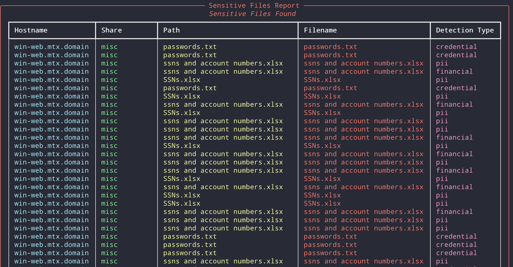

# pyShares - Python-based Active Directory File Share Scanner


[](https://youtu.be/Co3mxy3Nk4o)
*Click the image above to watch the demo video*

A Python-based network share scanner that enumerates and analyzes SMB shares across a Windows domain environment.

I wanted a tool that could scan an entire AD environment and provide a report of all shares, permissions, and sensitive files for various reporting purposes, including DLP/etc. This is that tool.

The platform utilizes various chunks of [impacket](https://github.com/fortra/impacket) to prevent code-re-use/re-create. 

## Features

- Domain-integrated scanning using LDAP authentication
- Multi-threaded share enumeration
- Detection of sensitive files based on patterns
- PostgreSQL database storage for results
- Rich CLI interface with detailed reporting
- CSV export capabilities



## Prerequisites

- Python 3.8+
- PostgreSQL database
- Domain user credentials with appropriate access
- Network access to target domain controller and shares

## Installation

1. Clone the repository
2. Create a virtual environment:

```
python -m venv venv
source venv/bin/activate # Linux/Mac (Tested from Linux)
venv\Scripts\activate # Windows
```

3. Install dependencies:

```
pip install -r requirements.txt
```

4. Create a `.env` file with database configuration:

```
DB_HOST=postgres
DB_PORT=5432
DB_NAME=fileshare_db
DB_USER=fileshare_scanner
DB_PASSWORD=your_secret_password

# Session & Security
NODE_ENV=production
## node -e "console.log(require('crypto').randomBytes(32).toString('hex'))" -- create a unique one
JWT_SECRET=2c45bac7c54349c133....65

# URLs - DO NOT CHANGE
FRONTEND_URL=http://localhost
BASE_URL=http://localhost
VITE_SCANNER_API_URL=/scanner-api
```

## Building the Docker Image

To build and run the application using Docker, follow these steps:

1. Ensure you have Docker and Docker Compose installed on your machine.
2. Modify the `docker-compose.yml` file if necessary, particularly the database username and password.
3. Make sure the `.env` file is in the root directory of the project.
4. Build and start the Docker containers:

```
docker-compose up --build
```

This command will build the Docker images as specified in the `docker-compose.yml` file and start the services.

You can then access your application at `http://localhost`. Frontend it with Nginx, HAProxy, etc. 

4. To access the PostgreSQL database, you can run:

```
docker exec -it postgres psql -U postgres
```

If you need to quickly review it, you can do:

```
docker exec -it docker-postgres-1 psql -U fileshare_scanner -d fileshare_db
```

Then use `\dt` to review the tables.

## Usage

Basic scan of domain computers:

```
python src/main.py --dc DC01.domain.local --domain domain.local
```

Additional options:
```
    --dc                        TEXT     Domain controller hostname or IP [default: None] [required]
    --domain                    TEXT     Domain name (e.g., company.local) [default: None] [required]
    --port                      INTEGER  LDAP port number [default: 389]
    --threads                   INTEGER  Number of concurrent scan threads (default: 10) [default: 10] 
    --ou                        TEXT     Specific OU to scan [default: None]
    --filter                    TEXT     LDAP filter for computer search [default: all]
    --batch-size                INTEGER  Number of hosts to process in each batch [default: 1000]
    --help                               Show this message and exit.
```

## Components

1. **Scanner**: Core scanning engine for share enumeration
2. **Pattern Matcher**: Sensitive file detection patterns
3. **Report Generator**: Generates detailed reports

## Database Schema

The application uses PostgreSQL with the following main tables:
- `shares`: Main share information
- `share_permissions`: Share permission details
- `sensitive_files`: Detected sensitive files
- `root_files`: Root directory listings

## Security Considerations

- Requires domain user credentials (local or admin depending on what you want to pull back)
- Stores credentials only in memory during runtime
- Logs sensitive file locations securely
- Uses connection pooling for database operations

## Contributing

Contributions are welcome!

## CYA

This was tested on a small subset of a large AD environment without issue. You may need to tweak the batch size depending on your environment, and be careful not to lock out your account / freeze up your DC. I haven't seen any issues with accounts, but I can't guarantee it. Any issues, please let me know!